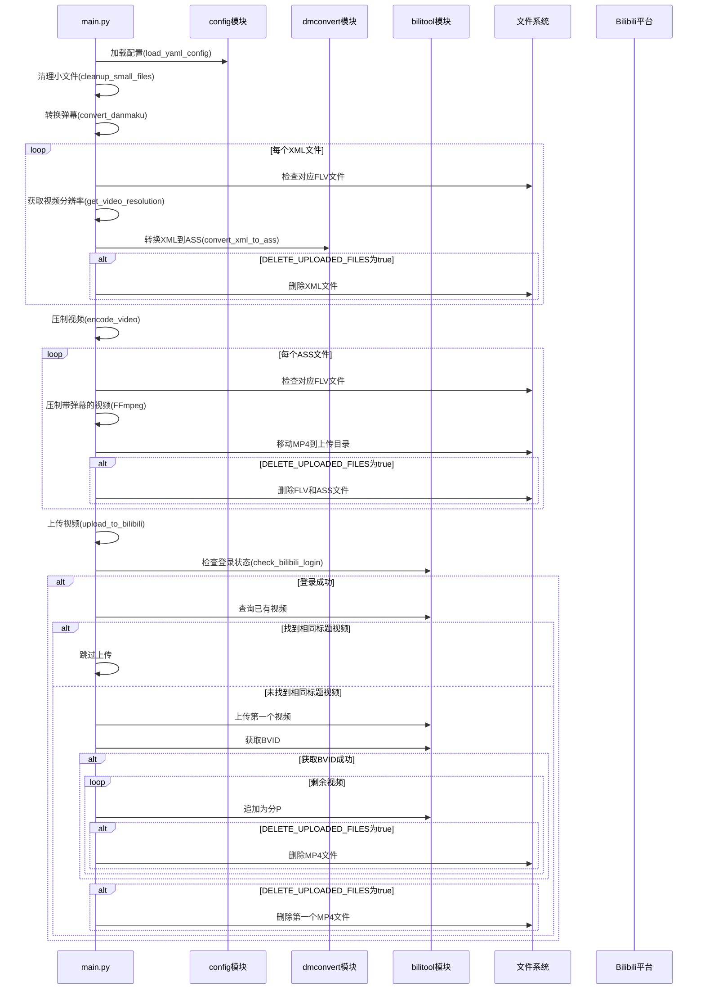

# Bilibili 自动录播处理与上传工具

本项目是一个自动化处理B站直播录像的工具，能够处理FLV格式的视频文件及其XML格式的弹幕，将其转换为带有内嵌弹幕的MP4视频，并自动上传到Bilibili，支持分P上传。

## 功能特点

* **自动清理小文件**：删除体积过小的无效录制文件及其对应的弹幕文件
* **弹幕转换**：将XML格式的弹幕文件转换为ASS字幕
* **视频压制**：使用FFmpeg (支持QSV硬件加速) 将视频和弹幕合并为MP4
* **智能上传**：
  * 自动检测已上传视频，避免重复投稿
  * 按时间顺序处理多个视频文件
  * 支持自动追加为同一视频的多个分P
* **定时执行**：设置间隔自动执行处理流程
* **统一配置**：通过配置文件控制所有行为，包括是否保留原始文件

## 处理流程



## 环境要求

* Python 3.x
* FFmpeg 和 FFprobe (推荐支持QSV的版本)
* biliup 上传工具
* Python依赖：schedule, PyYAML

## 安装步骤

1. 克隆或下载项目
   ```bash
   git clone <repository-url>
   cd <project-directory>
   ```

2. 安装Python依赖
   ```bash
   pip install schedule PyYAML
   ```

3. 安装biliup上传工具
   ```bash
   pip install biliup
   ```

4. 配置FFmpeg/FFprobe (确保可执行文件在PATH中或在config.py中指定路径)

5. 配置目录和参数
   * 编辑`config.py`设置处理目录、FFmpeg路径、间隔时间等
   * 创建并编辑`config.yaml`设置投稿信息
   * 确保已生成有效的Bilibili登录cookies文件

## 配置详情

1. **config.py 配置**
   * `PROCESSING_FOLDER`: 原始文件处理目录
   * `UPLOAD_FOLDER`: 上传文件目录
   * `MIN_FILE_SIZE_MB`: 最小有效文件大小(MB)
   * `FONT_SIZE`, `SC_FONT_SIZE`: 弹幕字体大小设置
   * `FFPROBE_PATH`, `FFMPEG_PATH`: 工具路径
   * `SCHEDULE_INTERVAL_MINUTES`: 定时执行间隔(分钟)
   * `DELETE_UPLOADED_FILES`: 处理后是否删除原始文件

2. **config.yaml 配置**
   ```yaml
   title: "【直播录像】{time} 弹幕版"  # {time}会被替换为日期时间
   tid: 171                        # B站分区ID
   tag: "直播录像,游戏实况,XXX"      # 标签，逗号分隔
   source: "https://live.bilibili.com/xxxx"  # 来源
   cover: ""                       # 封面路径
   desc: |                         # 视频简介
     这是自动录制的直播录像。
     欢迎关注！
   dynamic: "发布了新的录播视频"    # 动态内容
   ```

## 使用方法

1. **常规运行**
   ```bash
   python main.py
   ```
   
   脚本启动后会自动执行一次完整处理流程，然后按照设定的间隔定时执行。

2. **后台运行 (Linux/macOS)**
   ```bash
   nohup python main.py > logs/output.log 2>&1 &
   ```
   
   或使用screen/tmux:
   ```bash
   screen -S bilibili_uploader
   python main.py
   # Ctrl+A D 分离会话
   ```

3. **后台运行 (Windows)**
   * 使用Windows任务计划程序
   * 或使用第三方工具如NSSM将脚本注册为服务

## 工作机制说明

1. **定时任务循环**：脚本启动后会立即执行一次完整处理流程，然后每隔`SCHEDULE_INTERVAL_MINUTES`分钟再次执行

2. **清理小文件**：删除小于`MIN_FILE_SIZE_MB`的FLV文件及其XML文件

3. **弹幕转换过程**：
   * 跳过正在录制的视频（存在.part文件）
   * 获取视频分辨率以正确设置弹幕显示
   * 转换XML到ASS，根据设置决定是否删除原XML

4. **视频压制过程**：
   * 使用QSV硬件加速将FLV+ASS压制为MP4
   * 移动到上传目录，根据设置决定是否删除原FLV和ASS

5. **上传逻辑**：
   * 验证登录状态
   * 检查是否有相同标题的视频，有则跳过
   * 上传第一个视频后等待10秒获取BVID
   * 成功获取BVID后将剩余视频追加为分P
   * 根据设置决定是否删除已上传的MP4

## 注意事项

* 确保目录路径正确，推荐使用绝对路径
* 配置文件中的`title`模板支持`{time}`占位符，会被替换为视频时间
* 默认配置下原始文件不会被删除，可通过`DELETE_UPLOADED_FILES`控制
* 上传失败或无法获取BVID时，剩余视频会被跳过
* 确保定期检查日志监控系统运行状态

## 故障排除

* **上传失败**：检查cookies是否有效，网络连接是否正常
* **弹幕转换失败**：确认XML文件格式正确
* **压制失败**：检查FFmpeg是否正确安装及配置
* **文件路径问题**：使用绝对路径或确保相对路径正确
