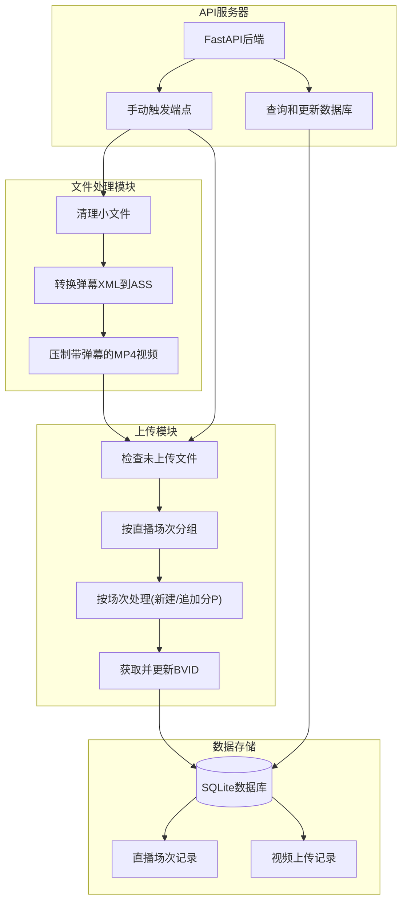
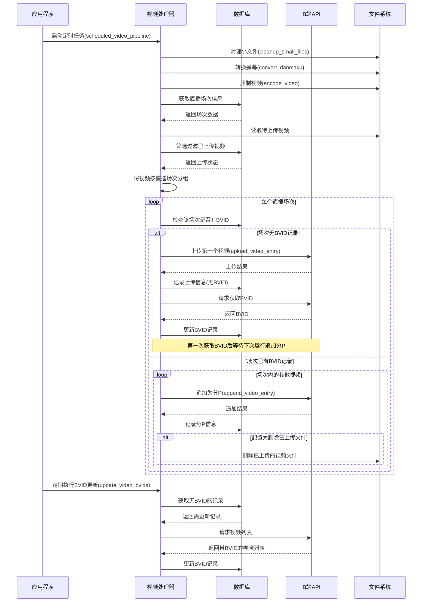

# Bilibili 自动录播处理与上传工具

这是一个功能完整的B站直播录像处理与上传工具，专为自动化处理直播录像设计。该工具可以处理FLV格式的视频文件及XML格式的弹幕，转换为带内嵌弹幕的MP4视频，并智能地上传到Bilibili，支持按直播场次分组、自动追加分P等高级功能。

## 功能特点

* **自动清理小文件**：删除体积过小的无效录制文件及其对应的弹幕文件
* **弹幕转换**：将XML格式的弹幕文件转换为ASS字幕
* **视频压制**：使用FFmpeg（支持QSV硬件加速）将视频和弹幕合并为MP4
* **智能上传**：
  * 自动识别直播场次，按时间段分组上传
  * 自动检测已上传视频，避免重复投稿
  * 支持自动追加为同一视频的多个分P
* **API支持**：提供RESTful API接口，支持手动触发和查询状态
* **数据库支持**：使用SQLite记录直播场次和上传记录
* **定时执行**：设置间隔自动执行完整处理流程

## 系统架构



## 处理流程



## 技术栈

* **Python 3**: 核心编程语言
* **FastAPI**: 提供RESTful API接口
* **SQLAlchemy**: ORM数据库操作
* **SQLite**: 轻量级数据库存储
* **FFmpeg/FFprobe**: 视频处理与信息提取
* **APScheduler**: 定时任务调度
* **B站上传API**: 通过bilitool库实现视频上传

## 安装要求

* Python 3.13+
* FFmpeg 和 FFprobe (推荐支持QSV的版本)
* SQLite
* 以下Python依赖:
  - bilitool >= 0.1.3
  - dmconvert >= 0.0.4
  - schedule >= 1.2.2
  - fastapi >= 0.111.0
  - uvicorn[standard] >= 0.30.1
  - sqlalchemy >= 2.0.31
  - aiosqlite >= 0.20.0

## 安装步骤

1. 克隆或下载项目代码
   ```bash
   git clone https://github.com/SimonGino/video_processor.git
   cd video_processor
   ```

2. 安装Python依赖
   ```bash
   pip install -e .
   ```
   
3. 配置环境
   * 编辑`config.py`设置处理目录、上传目录等参数
   * 编辑`config.yaml`设置B站投稿信息
   * 准备有效的B站cookies文件

## 配置说明

### config.py (核心配置)

* `PROCESSING_FOLDER`: 视频处理目录
* `UPLOAD_FOLDER`: 上传文件目录
* `MIN_FILE_SIZE_MB`: 最小有效文件大小(MB)
* `FONT_SIZE`, `SC_FONT_SIZE`: 弹幕字体大小
* `FFPROBE_PATH`, `FFMPEG_PATH`: 工具路径
* `SCHEDULE_INTERVAL_MINUTES`: 定时执行间隔(分钟)
* `DELETE_UPLOADED_FILES`: 上传后是否删除文件
* `API_BASE_URL`: API服务器地址
* `DEFAULT_STREAMER_NAME`: 默认主播名称

### config.yaml (B站上传配置)

```yaml
title: "银剑君直播录像{time}弹幕版"  # {time}会被替换为录播时间
tid: 171                      # B站分区ID
tag: "银剑君,直播录像,游戏实况"     # 视频标签
source: "https://www.douyu.com/251783"  # 视频来源
cover: ''                     # 自定义封面路径
dynamic: ''                   # 动态内容
desc: |                       # 视频描述
  银剑君的精彩直播录像！
  主播直播间地址：https://www.douyu.com/251783
  欢迎关注！
```

## 使用方法

### 启动API服务器
```bash
python app.py
```

这将启动FastAPI服务器，默认监听在 `0.0.0.0:50009`（可通过参数修改）。

### API端点

* `/log_stream_end`: 记录主播下播时间
* `/run_processing_tasks`: 手动触发视频处理任务
* `/run_upload_tasks`: 手动触发视频上传任务
* `/stream_sessions/{streamer_name}`: 获取主播的下播记录
* `/videos_without_bvid`: 获取所有未获取BVID的视频记录
* `/check_uploaded/{filename}`: 检查文件是否已上传

### 后台运行

#### Linux/macOS
```bash
nohup python app.py > app.log 2>&1 &
```

#### Windows
可使用Windows任务计划程序或将其注册为Windows服务。

## 工作流程详解

1. **准备阶段**:
   - 确保config.yaml和cookies.json文件正确配置
   - 设置正确的处理和上传目录

2. **执行周期**: 
   - API服务器启动后会立即执行一次完整处理
   - 之后按配置的间隔(默认60分钟)定期执行

3. **文件处理流程**:
   - 清理小于阈值的FLV和XML文件
   - 将未处理的XML弹幕转换为ASS
   - 将FLV和ASS压制为MP4并移动到上传目录

4. **上传流程**:
   - 获取所有未上传的MP4文件
   - 根据直播场次分组(基于时间段)
   - 对每个场次:
     - 首次上传创建新稿件
     - 等待获取BVID
     - 后续分P追加上传
   - 完整记录上传状态到数据库

## 故障排除

* **上传失败**: 检查cookies是否有效，网络连接是否正常
* **找不到直播场次**: 确认是否正确记录主播下播时间
* **BVID获取失败**: B站处理视频需要时间，下次运行时会自动重试
* **视频分组问题**: 检查主播下播记录是否完整且准确

## 贡献与反馈

欢迎提交问题报告和功能建议，也欢迎通过Pull Request贡献代码改进。

## 许可证

MIT License

Copyright (c) 2025 SimonGino

Permission is hereby granted, free of charge, to any person obtaining a copy
of this software and associated documentation files (the "Software"), to deal

