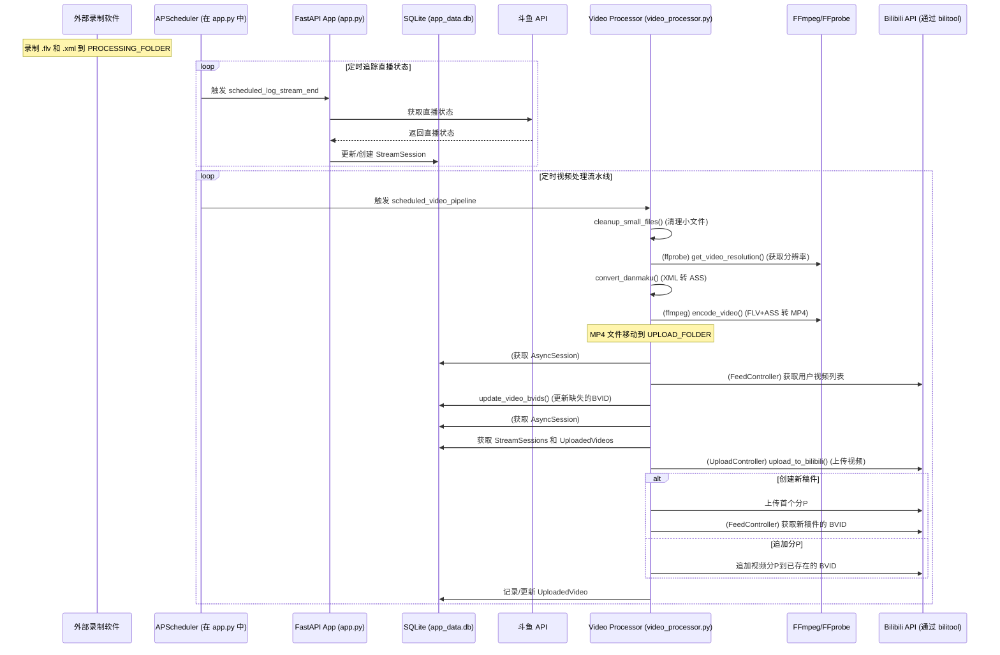

# BiliBili 全自动录播上传套件

[](https://github.com/SimonGino/video_processor/stargazers)
[](LICENSE) <!-- 请添加 LICENSE 文件 -->

全自动录制、处理您的直播流（例如斗鱼直播），并将带有弹幕的视频上传到哔哩哔哩！本套件专为希望轻松存档直播内容并解放双手的主播设计。

## ✨ 主要功能

*   **📡 自动直播状态追踪 (斗鱼):**
    *   定期通过斗鱼 API 检查主播开播状态。
    *   自动将直播的开始和结束时间记录到本地数据库。
    *   清理因意外（如程序崩溃）导致未正常记录结束时间的直播场次。
*   **🧹 文件管理与清理:**
    *   自动清理过小或不完整的 `.flv` 录制文件及其对应的 `.xml` 弹幕文件。
*   **💬 弹幕处理:**
    *   将 XML 格式的弹幕文件转换为 `.ass` 字幕格式。
    *   根据视频实际分辨率进行转换，确保弹幕位置准确。
*   **🎬 视频压制与弹幕内嵌:**
    *   将 `.flv` 录像文件与 `.ass` 弹幕文件硬编码压制为 `.mp4` 格式。
    *   **硬件加速:** 支持 Intel QSV (Quick Sync Video) 进行快速编码 (`h264_qsv`)。
*   **🚀 自动化哔哩哔哩上传:**
    *   自动上传处理完成的 `.mp4` 视频至哔哩哔哩。
    *   **智能多P稿件处理:**
        *   根据数据库中记录的直播场次信息，将属于同一场直播的视频分组。
        *   自动将一场直播中的第一个视频作为新稿件上传。
        *   上传后自动尝试从B站获取该稿件的 BVID。
        *   该场直播后续的视频将作为分P (P2, P3...) 追加到已获取的 BVID 下。
    *   在本地数据库中管理 BVID，并尝试为之前上传失败或未获取到 BVID 的稿件更新信息。
    *   通过 `config.yaml` 配置文件，自定义视频标题（支持 `{time}` 时间占位符）、简介、标签、封面等。
*   **⚙️ 稳定且定时的自动化流程:**
    *   使用 APScheduler 定期执行完整的处理流水线（清理、转换、压制、上传）。
    *   基于 FastAPI 的后端服务，用于管理直播场次、已上传视频记录，并支持手动触发各项任务。
*   **💾 持久化存储:**
    *   使用 SQLite 数据库 (`app_data.db`) 存储直播场次信息和已上传视频的元数据。
*   **🔧 灵活配置:**
    *   工作目录路径、FFmpeg/FFprobe 可执行文件位置、最小文件大小限制、弹幕字体、B站上传参数以及定时任务周期均可配置。

## 🌊 工作流程概览

系统主要通过定时任务自动循环执行以下步骤：

1.  **(外部) 录制软件:** 您选择的录制软件（如 BLRec / DDTVRec / StreamRec 等）将直播流保存为 `.flv` 文件，并将弹幕保存为 `.xml` 文件，两者均存放在 `PROCESSING_FOLDER` (处理中文件夹)。
2.  **直播状态记录 (定时任务):**
    *   `app.py` 中的定时任务会定期调用斗鱼 API，检查 `config.py` 中配置的主播是否正在直播。
    *   根据直播状态变化，在 `app_data.db` 数据库的 `StreamSession` 表中更新或创建直播场次的开始和结束时间。
3.  **视频处理流水线 (定时任务):**
    *   **文件清理:** `video_processor.py` 删除 `PROCESSING_FOLDER` 中过小或不完整的 `.flv` 文件及其对应的 `.xml` 文件。
    *   **弹幕转换:** 对于有效的 `.flv` 文件，其对应的 `.xml` 弹幕文件会被转换为 `.ass` 字幕文件。
    *   **视频压制:** `.flv` 文件将与对应的 `.ass` 弹幕文件进行硬编码，压制成 `.mp4` 文件（使用 FFmpeg，支持 QSV 硬件加速）。输出的 `.mp4` 文件先暂存于 `PROCESSING_FOLDER`，成功后移动到 `UPLOAD_FOLDER` (待上传文件夹)。根据配置，原有的 `.flv`、`.ass` (以及 `.xml`) 文件会从 `PROCESSING_FOLDER` 中删除。
    *   **BVID 更新:** `video_processor.py` 检查数据库中是否存在已上传但缺少 BVID 的视频记录。它会通过 `bilitool` 调用B站API，尝试根据视频标题匹配并更新这些记录的 BVID。
    *   **上传至哔哩哔哩:** `video_processor.py` 扫描 `UPLOAD_FOLDER` 中新增的 `.mp4` 文件。
        *   查询数据库中的 `StreamSession` 直播场次信息，将视频文件按所属直播场次分组。
        *   如果某个视频是其所属场次的第一个待上传文件（或该场次之前没有成功上传并获得BVID的记录），则将其作为新稿件上传。
        *   上传成功后，尝试从B站获取这个新稿件的 BVID。
        *   该场次后续的其他视频文件，将作为分P追加到此前获取到的 BVID 之下。
        *   视频的标题、标签等投稿信息从 `config.yaml` 文件中读取。
        *   `app_data.db` 数据库中的 `UploadedVideo` 表会被相应更新。
        *   根据配置，已成功上传的 `.mp4` 文件可以从 `UPLOAD_FOLDER` 中删除。

### 时序图



## 🔩 核心组件

*   **`app.py`**:
    *   项目主 FastAPI 应用程序。
    *   使用 SQLAlchemy 和 `aiosqlite` 管理 SQLite 数据库 (`app_data.db`)。
    *   提供 API 接口，用于手动控制、状态查询和直播场次记录。
    *   运行 APScheduler 执行定时自动化任务。
    *   处理斗鱼直播状态的自动记录。
*   **`video_processor.py`**:
    *   包含文件清理、弹幕转换、视频压制和B站上传的核心逻辑。
    *   与 `ffprobe` 和 `ffmpeg` 命令行工具交互。
    *   使用 `bilitool` (假设的B站API工具库) 进行B站相关操作。
    *   直接使用 `app.py` 中创建的 `AsyncSession` 工厂进行数据库操作。
*   **`models.py`**:
    *   定义 SQLAlchemy 数据库模型：`StreamSession` (直播场次) 和 `UploadedVideo` (已上传视频)。
*   **`config.py`**:
    *   基于 Python 的配置文件，用于设置各种路径、FFmpeg/FFprobe可执行文件位置、定时任务间隔、文件删除策略、API基础URL以及默认主播信息。
*   **`config.yaml`**:
    *   YAML 格式的配置文件，专门用于B站上传相关的元数据：视频标题模板、标签、简介、分区ID (`tid`)、封面图片路径等。
*   **`bilitool` 和 `dmconvert` (假设存在)**:
    *   这些是由 `video_processor.py` 导入的辅助模块/脚本。
    *   `bilitool` 应该是一个B站API客户端 (处理登录、上传、动态查询等)。
    *   `dmconvert` 用于将 XML 弹幕转换为 ASS 格式。
    *   *您需要确保这些模块在您的 Python 环境中可用，或者与项目文件放在同一目录。*

## 🛠️ 安装与设置

1.  **克隆仓库:**
    ```bash
    git clone https://github.com/SimonGino/video_processor.git
    cd video_processor
    ```

2.  **Python 环境:**
    *   推荐使用 Python 3.8 或更高版本。
    *   创建并激活虚拟环境：
        ```bash
        python -m venv venv
        source venv/bin/activate  # Windows 系统: venv\Scripts\activate
        ```

3.  **安装依赖:**
    *   (如果项目中没有 `requirements.txt`) 请根据您的实际依赖创建一个 `requirements.txt` 文件，至少应包含：
        ```txt
        fastapi
        uvicorn[standard]
        sqlalchemy
        aiosqlite
        apscheduler
        aiohttp
        pyyaml
        requests
        # 如果 bilitool 和 dmconvert 可以通过 pip 安装，请添加它们
        # 否则，请确保它们位于项目目录中
        ```
    *   安装依赖：
        ```bash
        uv sync
        ```

4.  **安装 FFmpeg 和 FFprobe:**
    *   从 [ffmpeg.org](https://ffmpeg.org/download.html) 下载并安装 FFmpeg。
    *   确保 `ffmpeg` 和 `ffprobe` 可执行文件位于系统的 PATH 环境变量中，或者在 `config.py` 文件中更新 `FFMPEG_PATH` 和 `FFPROBE_PATH` 为其完整路径。
    *   若要使用 Intel QSV 硬件加速，请确保您的系统拥有兼容的 Intel 显卡和驱动程序。

5.  **获取 `bilitool` 和 `dmconvert`:**
    *   这两个模块看起来是自定义的或来自其他地方。请确保 `bilitool.py` (及其依赖如 `LoginController`, `UploadController`, `FeedController`) 和 `dmconvert.py` 文件与 `video_processor.py` 位于同一目录，或者如果它们是可打包安装的，请通过 pip 安装。
    *   *如果这些模块来自其他项目，请在此处提供获取说明或链接。*

## ⚙️ 配置

1.  **`config.py`:**
    *   `PROCESSING_FOLDER`: 您的录制软件保存 `.flv` 和 `.xml` 文件的绝对路径。
    *   `UPLOAD_FOLDER`: 处理完成的 `.mp4` 文件在上传前（以及可选地，上传后）存放的绝对路径。
    *   `YAML_CONFIG_PATH`: `config.yaml` 文件的路径 (默认为项目根目录下的 `config.yaml`)。
    *   `COOKIES_PATH`: 用于B站登录的 `cookies.json` 文件路径 (默认为项目根目录下的 `cookies.json`)。
    *   `MIN_FILE_SIZE_MB`: `.flv` 文件被视为有效的最小大小 (MB)。
    *   `FFPROBE_PATH`, `FFMPEG_PATH`: 如果 FFmpeg/FFprobe 不在系统 PATH 中，请指定其可执行文件的完整路径。
    *   `SCHEDULE_INTERVAL_MINUTES`: 主要视频处理流水线的运行频率 (分钟)。
    *   `DELETE_UPLOADED_FILES`: 设置为 `True` 表示在成功上传到B站后删除本地的视频文件。
    *   `DEFAULT_STREAMER_NAME`, `STREAMER_NAME`, `DOUYU_ROOM_ID`: 用于斗鱼直播状态追踪的主播名称和房间号。

2.  **`config.yaml`:**
    *   在项目根目录 (或 `config.py` 中 `YAML_CONFIG_PATH` 指定的路径) 创建 `config.yaml` 文件。
    *   此文件包含B站上传所需的元数据。
    *   **`config.yaml` 示例:**
        ```yaml
        # Bilibili 上传配置
        title: "【银剑君】直播录像 {time}" # {time} 会被替换为 YYYY年MM月DD日 格式的日期
        tid: 171 # B站视频分区ID (例如：171 代表单机游戏)
        tag: "直播录像,银剑君,游戏实况" # 逗号分隔的标签
        copyright: 2 # 投稿类型: 1为自制, 2为转载
        source: "https://live.douyu.com/251783" # 视频来源链接
        desc: |
          这是银剑君的直播录像。
          喜欢请三连支持！
          直播间: https://live.douyu.com/251783
        cover: "/path/to/your/default_cover.jpg" # 默认封面的绝对路径
        dynamic: "新的直播录像已上传！来看看吧~ {title} {url}" # 发布动态时的文字内容, {title}和{url}会被替换
        # 可选配置:
        # dtime: 180 # 定时发布延时 (分钟)，如果 bilitool 支持
        # cdn: "ws" # 偏好的上传线路 (例如: bda, ws, qn, kodo, cos, cos-internal)
        ```

3.  **`cookies.json`:**
    *   `bilitool` 需要此文件进行B站身份验证。
    *   通常，您可以通过在浏览器中登录B站，然后使用浏览器扩展程序 (如 "EditThisCookie", "Get cookies.txt") 导出 cookies 来获取此文件。
    *   将导出的 cookies 保存为 JSON 格式，并命名为 `cookies.json`，放置在项目根目录 (或 `config.py` 中 `COOKIES_PATH` 指定的路径)。
    *   **`cookies.json` 示例格式 (具体结构可能因 `bilitool` 的要求而异):**
        ```json
        [
            {
                "domain": ".bilibili.com",
                "expirationDate": 17xxxxxxxxx,
                "hostOnly": false,
                "httpOnly": false,
                "name": "SESSDATA",
                "path": "/",
                "sameSite": "no_restriction",
                "secure": false,
                "session": false,
                "storeId": "0",
                "value": "你的SESSDATA值",
                "id": 1
            },
            {
                "domain": ".bilibili.com",
                "expirationDate": 17xxxxxxxxx,
                "hostOnly": false,
                "httpOnly": false,
                "name": "bili_jct",
                "path": "/",
                "sameSite": "no_restriction",
                "secure": false,
                "session": false,
                "storeId": "0",
                "value": "你的bili_jct值",
                "id": 2
            }
            // ... 其他必要的 cookies
        ]
        ```
        *请确保此文件格式与您的 `bilitool` 所期望的一致。*

## ▶️ 使用方法

1.  **配置您的录制软件:**
    *   将其设置为将录制的 `.flv` 视频文件和 `.xml` 弹幕文件保存到 `config.py` 中指定的 `PROCESSING_FOLDER`。
    *   视频文件和弹幕文件的基本名称 (不含扩展名) 必须一致 (例如：`stream_20231026_103000.flv` 和 `stream_20231026_103000.xml`)。
    *   程序期望从文件名中提取时间戳用于上传，默认支持 `银剑君录播YYYY-MM-DDTHH_mm_ss.mp4` 这样的格式（注意，这里是最终`.mp4`文件的命名，但提取逻辑是基于录制文件的原始命名时间部分）。如果您的录制软件命名规则不同，请调整 `upload_to_bilibili` 函数中的时间戳解析逻辑或修改录制软件的命名规则。

2.  **启动应用程序:**
    ```bash
    python app.py
    ```
    这将启动 FastAPI 服务器，并且 APScheduler 将根据 `config.py` 中 `SCHEDULE_INTERVAL_MINUTES` 和其他定时器配置开始执行任务。

    ```bash
    nohup python app.py > app.log 2>&1 &
    ```
    使用nohup运行，可以避免终端关闭导致进程被杀掉。

3.  **访问 API (可选):**
    *   API 服务器默认运行在 `http://0.0.0.0:50009` (或由 `config.py` 中的 `API_BASE_URL` 配置的地址)。
    *   您可以使用 `curl` 或 Postman 等工具与以下 API 接口交互：
        *   `POST /run_processing_tasks`: 手动触发文件清理、弹幕转换、视频压制任务。
        *   `POST /run_upload_tasks`: 手动触发 BVID 更新和B站上传任务。
        *   `GET /stream_sessions/{streamer_name}`: 查看指定主播的直播场次历史记录。

4.  **监控日志:**
    *   应用程序会将日志输出到控制台。请留意任何错误信息或状态更新。

## 🤝 贡献代码

欢迎各种形式的贡献！如果您有改进、Bug修复或新功能想要添加：

1.  Fork 本仓库。
2.  创建一个新的分支 (`git checkout -b feature/AmazingFeature`)。
3.  进行您的修改。
4.  提交您的更改 (`git commit -m 'Add some AmazingFeature'`)。
5.  将分支推送到远程仓库 (`git push origin feature/AmazingFeature`)。
6.  发起一个 Pull Request。

请确保在适当时更新测试用例。

## 📜 开源许可证

本项目基于 MIT 许可证开源 - 详细信息请参阅 `LICENSE` 文件。(您需要在项目中创建一个 `LICENSE` 文件，通常包含 MIT 许可证的文本内容)。

---

**如果您觉得这个项目有用，请在 GitHub 上给它点一个 ⭐ 星星吧！您的支持是我们最大的动力！**
