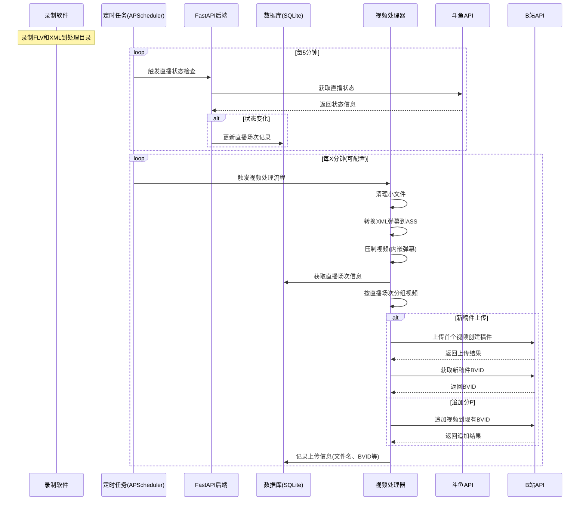

# BiliBili 全自动录播上传套件

[](https://github.com/SimonGino/video_processor/stargazers)
[](LICENSE)

全自动录制、处理直播流（如斗鱼直播），并将带弹幕的视频上传到哔哩哔哩的一站式解决方案。为希望轻松存档直播内容的主播或录播人员设计。

## ✨ 核心功能

- **📡 自动直播状态追踪**：定期检查主播开播状态，记录上下播时间
- **🧹 智能文件管理**：自动清理过小或不完整的录制文件
- **💬 弹幕处理转换**：XML格式弹幕转换为ASS字幕
- **🎬 视频压制与弹幕内嵌**：支持Intel QSV硬件加速，高效压制
- **🚀 智能哔哩哔哩上传**：
  - 按直播场次自动分组视频
  - 智能创建多P稿件或追加分P
  - 自动获取并记录BVID
- **⚙️ 定时任务与API支持**：全自动运行，支持手动触发
=======

## 🚀 快速开始

### 安装与环境配置

```bash
# 1. 克隆仓库
git clone https://github.com/SimonGino/video_processor.git
cd video_processor

# 2. 创建并激活虚拟环境
python -m venv venv
source venv/bin/activate  # Windows: venv\Scripts\activate

# 3. 安装依赖
uv sync

# 4. 确保安装FFmpeg (支持QSV)，或在config.py中指定路径
```

### 基本配置

1. **修改 `config.py` 文件**:
   ```python
   # 设置处理和上传文件夹路径
   PROCESSING_FOLDER = "/path/to/your/recording/folder"  # 录制文件存放路径
   UPLOAD_FOLDER = "/path/to/your/upload/folder"         # 处理后视频存放路径
   
   # 设置主播信息
   STREAMER_NAME = "你的主播名"
   DOUYU_ROOM_ID = "12345"  # 斗鱼房间号
   
   # 定时任务间隔（分钟）
   SCHEDULE_INTERVAL_MINUTES = 60
   ```

2. **创建 `config.yaml` 文件**:
   ```yaml
   # B站上传配置
   title: "【主播名】直播录像{time}"  # {time}会被替换为日期
   tid: 171                       # B站分区ID (171为单机游戏)
   tag: "直播录像,主播名,游戏实况"      # 视频标签
   source: "https://www.douyu.com/12345"  # 视频来源
   desc: |
     主播的精彩直播录像！
     直播间：https://www.douyu.com/12345
   ```

3. **准备B站登录凭据**:
   - 使用浏览器插件导出B站cookies到项目根目录的`cookies.json`
   - 或者项目根目录下执行bilitool login执行登录操作

### 启动服务

```bash
# 前台运行（开发调试）
python app.py

# 后台运行（生产环境）
nohup python app.py > app.log 2>&1 &
```

## ⚙️ 详细配置说明

### config.py 关键配置

| 配置项 | 说明 | 默认值 |
|-------|------|-------|
| PROCESSING_FOLDER | 录制文件处理目录 | "/vol2/1000/biliup" |
| UPLOAD_FOLDER | 处理后视频存放目录 | "/vol2/1000/biliup/backup" |
| MIN_FILE_SIZE_MB | 最小有效文件大小(MB) | 10 |
| FONT_SIZE | 弹幕字体大小 | 40 |
| SCHEDULE_INTERVAL_MINUTES | 定时任务间隔(分钟) | 60 |
| DELETE_UPLOADED_FILES | 上传后是否删除本地文件 | True |
| PROCESS_AFTER_STREAM_END | 是否仅在下播后处理 | True |
| API_BASE_URL | API服务器地址 | "http://localhost:50009" |

### config.yaml 投稿配置

| 配置项 | 说明 | 示例 |
|-------|------|------|
| title | 标题模板 | "主播直播录像{time}弹幕版" |
| tid | B站分区ID | 171 (单机游戏) |
| tag | 视频标签 | "主播名,直播录像,游戏实况" |
| desc | 视频简介 | 多行文本，支持Markdown |
| source | 转载来源 | "https://www.douyu.com/房间号" |
| cover | 封面图片路径 | 可选，留空使用B站默认截图 |

## 🌊 工作流程与时序

### 整体工作流程

1. **录制阶段**：外部录制软件将直播流保存为`.flv`文件和`.xml`弹幕文件
2. **直播状态监控**：定时检查主播状态并记录直播场次
3. **视频处理流水线**：
   - 清理无效小文件
   - 转换XML弹幕到ASS格式
   - 压制视频（硬编码弹幕）
4. **智能上传**：
   - 根据直播场次分组视频
   - 创建新稿件或追加分P
   - 更新数据库记录

### 时序图



### 关键流程说明

1. **直播状态检测流程**：
   - 定时任务定期调用斗鱼API检查直播状态
   - 当状态从未直播变为直播时，记录上播时间
   - 当状态从直播变为未直播时，记录下播时间
   - 如果配置了`PROCESS_AFTER_STREAM_END`，下播后立即触发处理

2. **视频处理与上传流程**：
   - 清理小于`MIN_FILE_SIZE_MB`的无效录制文件
   - 将有效XML弹幕转换为ASS格式
   - 使用FFmpeg结合QSV硬件加速压制视频
   - 根据文件时间戳和数据库中的直播场次信息分组视频
   - 按场次上传，每场直播的第一个视频创建新稿件，后续视频追加分P

## 📦 API接口

提供以下API接口用于手动触发和查询：

- `POST /run_processing_tasks`：手动触发视频处理（清理、转换、压制）
- `POST /run_upload_tasks`：手动触发视频上传
- `GET /stream_sessions/{streamer_name}`：查询主播直播场次记录
- `GET /videos_without_bvid`：查询缺失BVID的视频记录

## 📄 其他信息

### 系统要求

- Python 3.8+
- FFmpeg (推荐带Intel QSV支持)
- 足够的磁盘空间用于存储录制和处理后的视频

### 依赖项目

- FastAPI、SQLAlchemy：后端API和数据库
- bilitool：B站API封装
- dmconvert：弹幕转换工具

### 贡献与许可

本项目使用MIT许可证开源。欢迎通过Pull Request或Issues贡献代码和反馈问题。

---

**如果此项目对您有帮助，请在GitHub上给它一个⭐️！**
